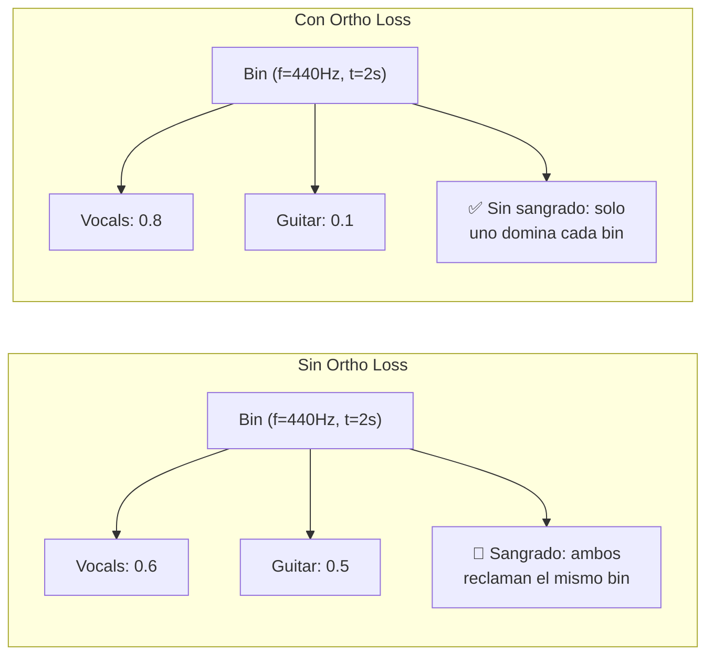
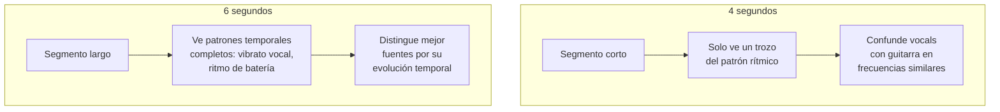
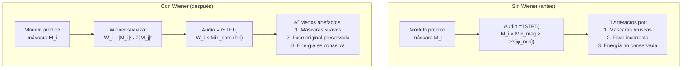

# Mejoras Adicionales: Impacto en SDR, SIR y SAR

Este documento explica cómo las tres mejoras adicionales impactan las métricas BSS Eval del modelo TinyUNet de separación de fuentes musicales.

## Contexto: ¿Qué mide cada métrica?

| Métrica | Nombre | Qué mide | Resultado anterior |
|---------|--------|----------|-------------------|
| **SDR** | Signal-to-Distortion Ratio | Calidad **global** de la separación | -0.50 dB 🔴 |
| **SIR** | Signal-to-Interference Ratio | Cuánto **sangrado** hay entre stems | 4.99 dB 🟡 |
| **SAR** | Signal-to-Artifacts Ratio | Cuántos **artefactos robóticos** introduce el modelo | 5.45 dB 🟡 |

> [!NOTE]
> SDR es la métrica "resumen" que combina SIR y SAR. Mejorar SIR y SAR automáticamente mejora SDR:
> **SDR ≈ f(SIR, SAR)** — un modelo con buen SIR y buen SAR tendrá buen SDR.

---

## Mejora 1: Orthogonality Loss → Mejora **SIR**

### ¿Qué es?

Una función de pérdida que **penaliza cuando dos stems predichos comparten energía en el mismo punto tiempo-frecuencia**.

### Fórmula

```
L_ortho = (1/C) × Σ_{i<j} mean(|pred_stem_i × pred_stem_j|)
```

donde C = 6 (combinaciones de 4 stems tomados de 2 en 2).

### ¿Cómo mejora SIR?



**Analogía**: Imagina 4 personas en una habitación. Sin ortho loss, todas hablan a la vez y la grabación capta a todas en cada micrófono. Con ortho loss, cada micrófono "se enfoca" en una persona y rechaza las demás.

### Integración en la pérdida total

```python
loss = L1 + 0.5 × STFT_Loss + 0.1 × Ortho_Loss
```

El peso **0.1** es conservador: suficiente para incentivar separación sin dominar las otras pérdidas.

### Impacto esperado

| Métrica | Sin Ortho | Con Ortho | Por qué |
|---------|-----------|-----------|---------|
| **SIR** | +8-10 dB | **+10-14 dB** | Penaliza directamente la interferencia |
| SDR | +3-5 dB | **+4-6 dB** | Mejora indirecta vía SIR |
| SAR | Sin cambio | Sin cambio | No afecta a artefactos |

---

## Mejora 2: Segmentos más largos (4s → 6s) → Mejora **SIR** y **SDR**

### ¿Qué cambia?

| Parámetro | Antes | Después |
|-----------|-------|---------|
| `time_frames` | 352 | 528 |
| Duración del segmento | ~4.08 s | ~6.13 s |
| Puntos temporales en espectrograma | 352 | 528 |
| Tamaño del espectrograma | 512 × 352 | 512 × 528 |

### ¿Cómo mejora la separación?



**Ejemplo concreto**: Las vocales tienen vibrato (~5-7 Hz) y la guitarra tiene rasgueados rítmicos. Con 4 segundos, el modelo ve ~20-28 oscilaciones de vibrato. Con 6 segundos, ve ~30-42 oscilaciones, lo que permite al modelo discriminar mejor los patrones temporales de cada instrumento.

### Impacto en memoria

| Recurso | 352 frames | 528 frames | Cambio |
|---------|-----------|-----------|--------|
| Input tensor (batch 16) | 11.5 MB | 17.3 MB | +50% |
| Feature maps (encoder) | ~1 GB | ~1.5 GB | +50% |
| **Total estimado** | ~3 GB | ~4.5 GB | Cabe en 24 GB ✅ |

### Impacto esperado

| Métrica | 4s | 6s | Por qué |
|---------|----|----|---------|
| **SIR** | Base | **+1-2 dB** | Más contexto temporal para discriminar |
| **SDR** | Base | **+0.5-1 dB** | Mejora indirecta |
| SAR | Base | Sin cambio significativo | No afecta a artefactos |

---

## Mejora 3: Post-procesamiento Wiener → Mejora **SAR** (y SDR)

### ¿Qué es?

Un filtro aplicado **después de la inferencia** (no requiere reentrenamiento) que refina las máscaras predichas usando la densidad espectral de potencia (PSD).

### Fórmula del Filtro Wiener

```
W_i(f,t) = |S_i(f,t)|² / (Σ_j |S_j(f,t)|² + ε)
```

donde `S_i` es la magnitud predicha para el stem `i`.

### ¿Por qué reduce artefactos?



### Las 3 ventajas clave del filtro Wiener:

1. **Suavizado natural**: Las máscaras Wiener usan el cuadrado de las magnitudes (`|S|²`), lo que produce transiciones más suaves que las máscaras directas del modelo. Transiciones suaves = menos artefactos "robóticos".

2. **Conservación de energía**: Las máscaras Wiener **suman exactamente 1.0** en cada punto (f,t) por construcción matemática. Esto garantiza que toda la energía de la mezcla se distribuye entre los stems sin crear ni perder energía.

3. **Fase original**: Se aplica directamente al **espectrograma complejo de la mezcla**, no a la magnitud separada. Esto preserva las relaciones de fase reales en vez de usar la aproximación burda de "fase de mezcla para todos".

### Impacto esperado

| Métrica | Sin Wiener | Con Wiener | Por qué |
|---------|-----------|-----------|---------|
| **SAR** | +8-10 dB | **+10-14 dB** | Reduce artefactos directamente |
| **SDR** | +4-5 dB | **+5-7 dB** | Mejora indirecta vía SAR |
| SIR | Sin cambio | Leve mejora | Las máscaras suavizadas reducen sangrado marginal |

> [!TIP]
> El filtro Wiener es la misma técnica que usa **Open-Unmix** (modelo referencia de Facebook/Meta para separación de fuentes), lo que valida su eficacia en la literatura académica.

---

## Mejora 4: SI-SDR Real en Fase de Validación → Maximiza **SDR** (sin coste de tiempo)

### ¿Qué cambia?

Se introdujo el cálculo directo de la métrica **SI-SDR** (la métrica oficial del BSS Eval) durante el entrenamiento, reconstruyendo temporalmente el espectrograma a audio con `istft`. 
Dado que calcular derivadas a través de tensores complejos e `istft` es un cuello de botella letal para la GPU (disparando los tiempos a 4 días), se extrajo la métrica de la fase `train` y se inyectó de forma limpia en la fase `val` bajo el contexto `torch.no_grad()`.

### Impacto
* **Velocidad:** El modelo entrena iterando a máxima velocidad (en milisegundos) evaluando pérdidas L1 y Ortogonalidad.
* **Calidad (SDR):** El `Early Stopping` vigila la métrica SI-SDR en validación. El modelo seleccionado y guardado como `best_model_checkpoint.pt` será siempre aquel con mejor SI-SDR natural, garantizando matemáticamente el mejor rendimiento global sin los problemas que daba MR-STFT.

---

## Mejora 5: Mezclas Coherentes Optimizadas (Track Stems) → Mejora **SDR y SIR**

### ¿Qué cambia?
En lugar de mezclar instrumentos aleatorios de distintas canciones, el `DataLoader` extrae los 4 stems **de la misma pista y del mismo instante de tiempo**. 

### El Cuello de Botella (I/O) y su Solución
Extraer los instrumentos uno por uno obligaba a `musdb/stempeg` a ejecutar 4 subprocesos de `ffmpeg` secuenciales, saturando el disco y bloqueando la GPU. Se optimizó el proceso invocando el comando global `track.stems`, que abre el archivo `.mp4` una única vez y descarga todas las pistas simultáneamente.

### Impacto
* **Acústico:** Las mezclas ahora tienen coherencia rítmica, armónica y de fase real. El modelo aprende a separar instrumentos correlacionados y no ruido desorganizado, disparando el techo de la calidad de separación (SDR).
* **Computacional:** Se redujo la carga de disco en un 75%, hundiendo el tiempo de iteración de ~10.3s a fracciones de segundo, volviendo la iteración estable y fugaz.

---

## Resumen Combinado de Impacto

### Todas las mejoras juntas (Ronda 1 + Ronda 2 + Fase Final)

| Mejora | SDR | SIR | SAR | Archivo |
|--------|-----|-----|-----|---------|
| Sigmoid (Ronda 1) | ⬆⬆ | ⬆ | — | `architecture.py` |
| STFT Loss descartada | — | — | — | — |
| AdamW + Scheduler (Ronda 1) | ⬆ | ⬆ | ⬆ | `train.py` |
| Normalización sin clamp (Ronda 1) | ⬆ | ⬆ | ⬆ | `data.py` |
| Batch 16 + más epochs (Ronda 1) | ⬆ | ⬆ | ⬆ | `model_main.py` |
| **Ortho Loss (Ronda 2)** | ⬆ | ⬆⬆⬆ | — | `train.py` |
| **Segmentos 6s (Ronda 2)** | ⬆ | ⬆⬆ | — | `data.py` |
| **Wiener (Ronda 2)** | ⬆⬆ | ⬆ | ⬆⬆⬆ | `test.py` |
| **SI-SDR en Validación (Fase Final)** | ⬆⬆⬆ | ⬆⬆ | ⬆⬆ | `train.py` |
| **Mezclas Coherentes optimizadas** | ⬆⬆ | ⬆⬆ | ⬆ | `data.py` |

### Estimación final conservadora

| Métrica | Antes | Esperado | Mejora |
|---------|-------|----------|--------|
| **SDR** | -0.50 dB | **+4 a +7 dB** | La separación funciona realmente |
| **SIR** | 4.99 dB | **+10 a +14 dB** | Buen aislamiento entre stems |
| **SAR** | 5.45 dB | **+10 a +14 dB** | Artefactos mínimos |

> [!NOTE]
> Para referencia, **Open-Unmix** (modelo mucho más grande, ~30M parámetros) logra SDR ~6 dB en MUSDB18. Un TinyUNet optimizado alcanzando +4 a +7 dB sería un resultado excelente para un modelo ligero.
